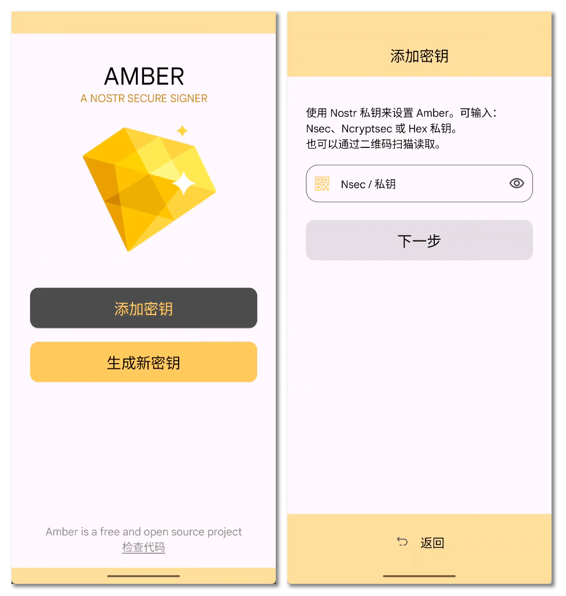
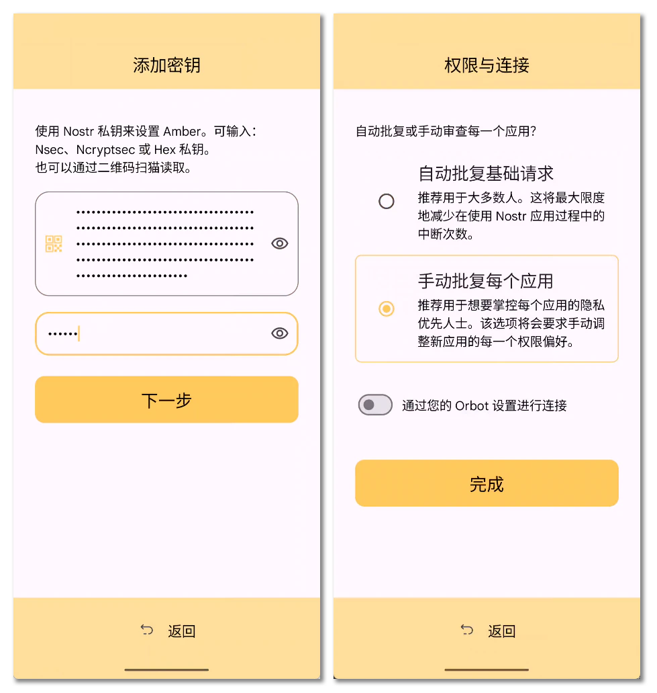
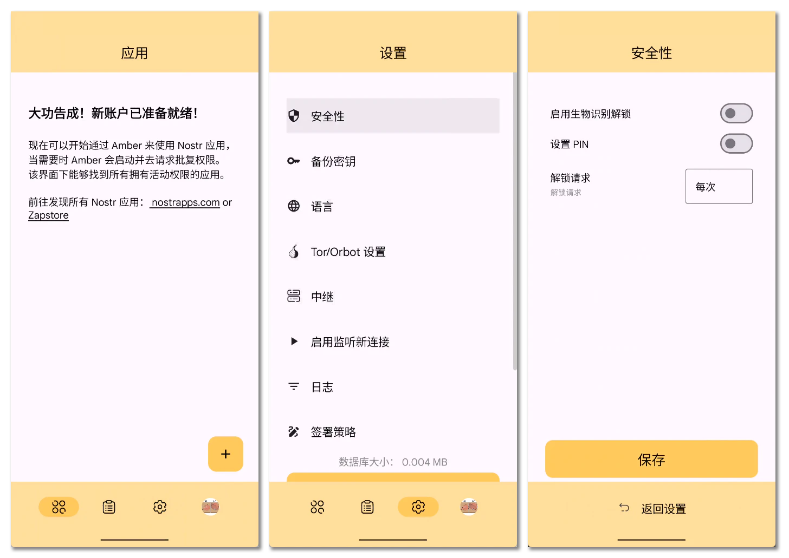
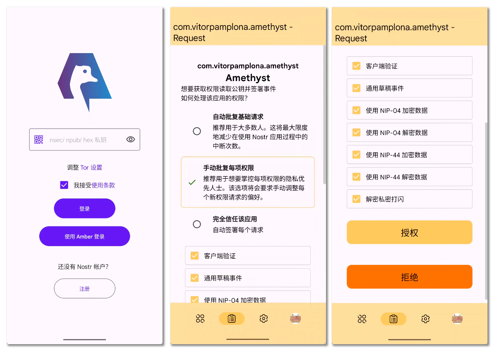
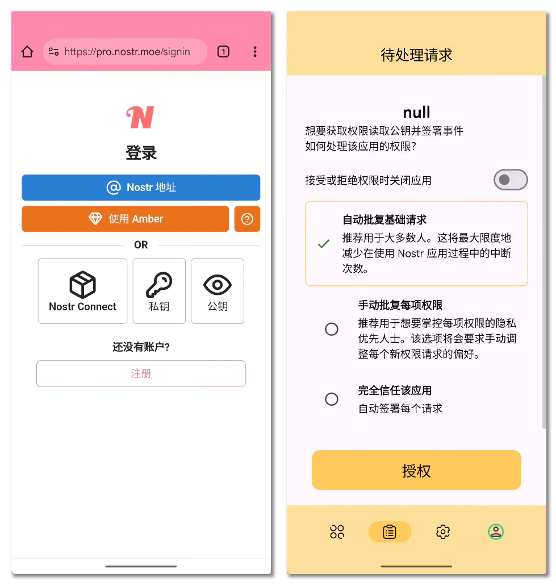
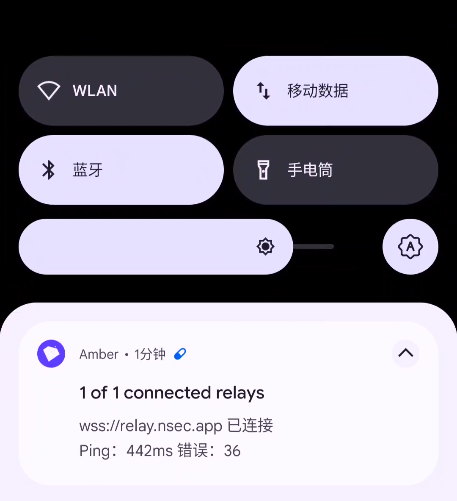
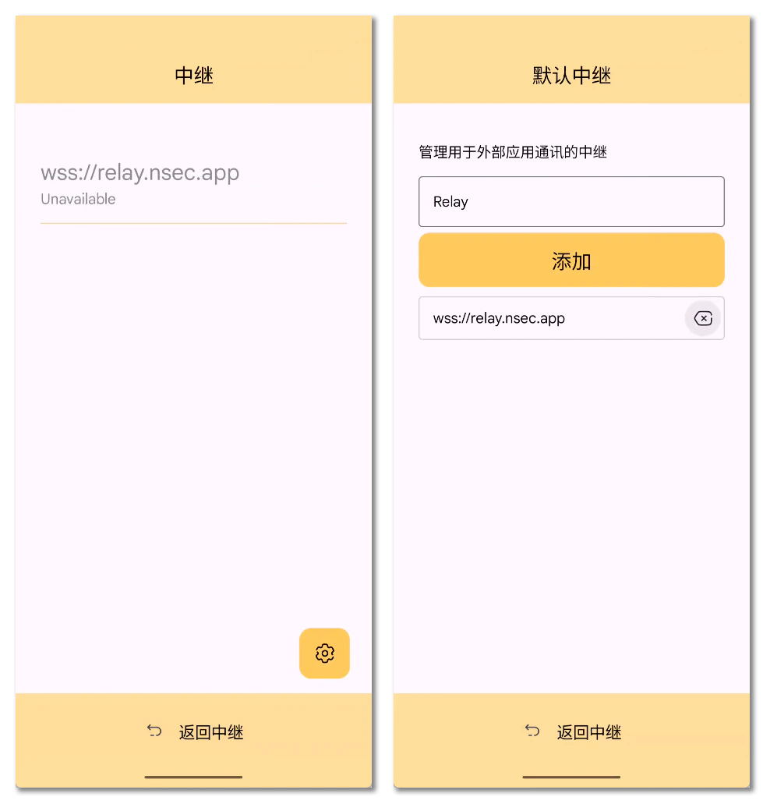

# Android 密钥管理 {#android-key-management}

Nostr 是一个密钥对身份系统, 由于其无序的密钥对, 使得普通人并不能将它如同银行卡密码一样在脑中记忆, 而大量的 Nostr 应用又需要频繁地签署事件, 所以普通的只能最多计算 TOTP 的密码管理器并不能兼任如此复杂的密钥管理和签署需求.

在浏览器中我们可以使用 nos2x 这类浏览器扩展实行密钥管理, 避免私钥直接保存在 Web 应用中, 让应用向密钥管理器请求签名, 密钥管理器同时兼任「{签名器|Signer}」的职责将事件签名后返回, 应用只能请求权限去签署而不能直接控制私钥, 显著提高了安全性.

虽然在移动设备上也有很多浏览器直接支持 Chrome 或者 Firefox 的浏览器扩展, 但是将密钥分布在多个管理器中并不是安全的做法, 并且浏览器扩展并不适合存储至关重要的机密信息, 所以最好的办法是在一个集中的地方实行密钥管理, 减少攻击面, 使得密钥所有者可以专注于一个位置确保密钥安全. 同时, 浏览器扩展无法跨进程调用, 这使得原生的 Android 应用无法适应这种密钥管理方法.

最后的一个原因, 浏览器密钥管理器的原型 nos2x 并不支持多密钥账户, 这使得拥有多个 Nostr 账户的用户只能添加多个浏览器用户资料使用多个 nos2x 扩展来管理, 但 Android 的 Chrome 在内的浏览器都是不支持多个浏览器资料的, 所以 Android 更加需要一个完全原生的密钥管理器以支持多账户.

本篇将介绍 Android 的 Nostr 密钥管理和签名器的基础使用方式, 涉及 "**NIP-55: Android 签名器应用**".

> [nips/55.md at master · nostr-protocol/nips](https://github.com/nostr-protocol/nips/blob/master/55.md)

## 琥珀 {#about-amber}

「{琥珀|Amber}」是 Nostr 开发者 *greenart7c3* 开发提供的 Android 原生 Nostr 密钥管理器和签名器, NIP-55 就是以琥珀为原型提案标准化的 NIP 议案.

> [greenart7c3/Amber](https://github.com/greenart7c3/Amber)

所以如果要在 Android 上进行密钥管理, 琥珀就是绕不开的选项.

## 安装与配置 {#install-amber}

前往 GitHub 的 Releases 页面下载获取适合你的 Android 设备架构的应用包并安装.

> [Releases · greenart7c3/Amber](https://github.com/greenart7c3/Amber/releases)

::: info
本文将使用琥珀 `v3.3.0` 作为示例, 涉及私钥的部分将仅使用 ncryptsec 形式进行操作.
:::

  

启动琥珀, 点击「添加密钥」, 输入 ncryptsec 私钥.

  

输入 ncryptsec 的加密密码后, 点击下一步选择「手动批复每个应用」而不是默认的「自动批复基础请求」.

  

点击底栏的齿轮即设置按钮, 进入「安全性」设置, 根据你的习惯启用生物识别解锁或者 PIN 码解锁, 解锁请求是指每次授权请求解锁后允许保持解锁状态的间隔, 最安全的状态既是每次请求都要解锁, 当然也可按需设置.

到此琥珀的密钥管理功能已经配置基本完成, 可以随意探索应用功能. 要注意, 签名器本身不会要求签署任何事件, 所以无需担心误操作.

对于多个密钥, 可以通过账户头像也就是第四个底栏图标进行选择和添加新密钥账户.

## 使用签名器 {#amber-usage}

以三大客户端的 Android 客户端「{紫水晶|Amethyst}」为例, 现在已经完全支持琥珀作为外部签名器登录.

> [vitorpamplona/amethyst: Nostr client for Android](https://github.com/vitorpamplona/amethyst)

  

安装紫水晶, 打开应用就可以看到「使用 Amber 登录」, 在权限申请部分往下滑动就可以浏览应用向签名器预申请了什么权限, 对于不需要或者不清楚具体作用的权限, 可以取消勾选拒绝授权.

::: info
演示使用的紫水晶版本为 `v0.94.3 (418)`.
:::

图中所显示的权限:

1. **客户端验证**: 定义在 [NIP-42](https://github.com/nostr-protocol/nips/blob/master/42.md), 是中继向客户端发起验证时要求签署的临时事件.
2. **通用草稿事件**: 定义在 [NIP-37](https://github.com/nostr-protocol/nips/blob/master/37.md), 是客户端保存一些还没有正式签署发布的事件的事件, 也就是草稿. 要注意的是, 如果启用了草稿, 那么紫水晶会将草稿保存在应用缓存内, 如果需要删除这个草稿事件则也需要签名器签署删除事件.
3. **NIP-04 加解密**: [NIP-04](https://github.com/nostr-protocol/nips/blob/master/04.md) 是普通 Nostr 私信的议定, 由于其实现简单, 即使现在不再被推荐使用, 大多数客户端还是会选择支持, 以满足一些低安全性要求的消息交换. 所以即使是不安全的(存在元数据泄露风险), 这个 NIP 的私信内容也是加密的.
4. **NIP-44 加解密**: [NIP-44](https://github.com/nostr-protocol/nips/blob/master/44.md) 是新版通用载荷加密议定, 主要用于强化安全性后的加密私信 [NIP-17](https://github.com/nostr-protocol/nips/blob/master/17.md).
5. **私密打闪**: 「{打闪|Zap}」就是 Nostr 集成的比特币经济基础闪电网络的付款消息, 发送打闪的对方可以选择将打闪加密, 而接收方的我们可以选择解密后就能看到打闪内的消息了.

紫水晶请求的基础权限非常精简, 这些权限都可以直接授权, 当然如果你不需要, 始终可以取消授权, 当应用内的操作涉及到相关未授权权限的时候, 应用会再次发起权限请求.

Nostr!moe 基于 noStrudel 的专业版客户端也支持使用琥珀登录:

> <https://pro.nostr.moe>

  

虽然部分 Web 应用也能支持琥珀登录, 但大多数的使用体验并不如直接在原生 Android 应用使用的体验好, 在 Web 应用中使用琥珀更好的办法应该是使用「{掩体|Bunker}」远程连接到琥珀, 这能够在桌面端和移动端都获得相近的体验, 这部分内容会在下一篇文章中详细讲述.

## 琥珀的连接监听 {#amber-connection-listen}

细心的读者可能发现了, 安装完琥珀之后, 状态栏里面就多出来了一个琥珀的持久通知, 提示正在连接到一个名为 `wss://relay.nsec.app` 的中继, 这就是琥珀提供掩体来作为远程签名器使用的核心.

  

当然我们现在还暂时用不上, 所以可以去琥珀设置里面的中继设置选项里面去除这个中继, 重启进程之后琥珀就不会再自动连接到它了:

  

进入设置, 「中继」, 「活动中继」设置.

  

点击右下角的齿轮图标也就是活动中继设置, 将 `wss://relay.nsec.app` 删除, 返回中继.

在下一个篇章中, 我们将会在这里设置一种和这个中继相同用途的特殊掩体中继, 以便于我们在 Android 上的琥珀直接接受所有支持掩体连接的应用的签署和授权请求, 甚至不再需要浏览器扩展和其他的密钥管理器.

## 实用工具 {#utilities}

- [nowser](https://github.com/haorendashu/nowser), 一个还在开发中的内嵌密钥管理功能的 Android 浏览器.
- [Obtainium](https://github.com/ImranR98/Obtainium), 直接从 GitHub 获取 Android 应用更新.
