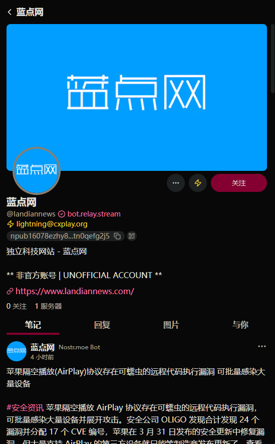
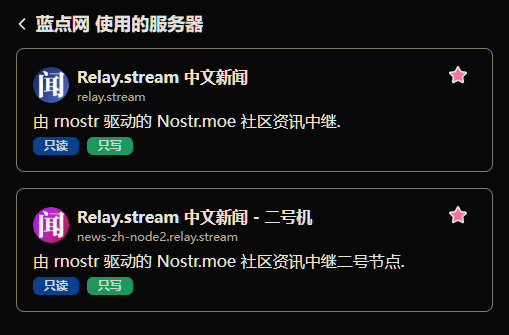

# 手动管理元数据 {#manually-managing-metadata}

Nostr 是一个纯文本协议, 意味着人类也能清晰地理解协议通讯流程. 几乎所有的 Nostr 事件都由各种各样的客户端生成后签署再发布到中继, 但为了更加可控地管理一些关键事件, 比如用户资料元数据类型 `kind:0` 和信箱列表元数据类型 `kind:10002`, 完全可以通过手动编写 JSON 结构来签署后发布.

当然大部分的客户端也都带有友好的图形界面交互, 也能完成全部管理能力. 所以本文也将以元数据事件为例, 借助命令行工具向读者展示 Nostr 事件的生成和签署再到发布的基本流程, 这能增进读者对于 Nostr 网络中中继和客户端关系的认知.

本文将使用到的工具有:

- **nak**: [fiatjaf/nak](https://github.com/fiatjaf/nak) (见[《高级密钥生成指南》](/start/become-hacker/)篇章)
- **jq**: [jqlang/jq](https://github.com/jqlang/jq) (使用包管理器或手动安装)

::: tip
本文将使用社区消息机器人的一个账号作为演示. 文中涉及到私钥的操作都将使用 ncryptsec[^1] 完成.
:::

## 用户资料元数据 {#user-profile-metadata}

也许你已经在此之前就通过本站的指引或者其他方式发布过了自己的元数据, 所以可以使用 nak 获取现有的元数据:

```bash:no-line-numbers
nak req -k 0 \
        -a d3fc7c8ae439546771db5ed86259e2ebc56d03b6e38ec78697249202757f5cde \
        relay.damus.io \
        | jq
```

获得响应:

```json
{
  "kind": 0,
  "id": "6f11191d25453689b1ec3658cf159dda85157b4be7a437b84a111bf5e6796c24",
  "pubkey": "d3fc7c8ae439546771db5ed86259e2ebc56d03b6e38ec78697249202757f5cde",
  "created_at": 1746003099,
  "tags": [],
  "content": "{\"name\":\"蓝点网\",\"about\":\"独立科技网站 - 蓝点网\\n\\n** 非官方账号 | UNOFFICIAL ACCOUNT **\",\"picture\":\"https://encrypted-tbn0.gstatic.com/images?q=tbn:ANd9GcR4uIqXsH-Ttw2z_G_kNpFcoYjV_uYkgTO7EQ&s\"}",
  "sig": "0ab4b23d82857c3a114994bd4aff6156750cc7daba6ee93cdf68f7980e24a22e758d031376e03ced7be16207c94f694de9dd2e450aea2ea8860391288a107986"
}
```

Nostr 的用户资料以类型为 `kind:0` 的 JSON 对象签署保存, 具体的用户资料字段又以 JSON 对象的形式被转义保存在 content 键的值中.

所以可以在获取 `kind:0` 事件的时候直接使用 jq 查询 content 并格式化为 JSON:

```bash:no-line-numbers
nak req -k 0 \
        -a d3fc7c8ae439546771db5ed86259e2ebc56d03b6e38ec78697249202757f5cde \
        relay.damus.io \
        | jq '.content | fromjson'
```

得到:

```json
{
  "name": "蓝点网",
  "about": "独立科技网站 - 蓝点网\n\n** 非官方账号 | UNOFFICIAL ACCOUNT **",
  "picture": "https://encrypted-tbn0.gstatic.com/images?q=tbn:ANd9GcR4uIqXsH-Ttw2z_G_kNpFcoYjV_uYkgTO7EQ&s"
}
```

如果你没有获得预期中的事件或者不知道在哪个中继中获取也不用担心, 现在开始我们会重新编写一个元数据.

### 编写 {#write-user-profile}

使用如下的 JSON 模板, 编写一个普遍适用的 Nostr 用户资料:

```json
{
  "name": "用户名",
  "display_name": "实际显示用户名",
  "displayName": "实际显示用户名",
  "about": "描述文本",
  "picture": "头像图片链接",
  "banner": "资料横幅图片链接",
  "website": "网站链接",
  "nip05": "域名身份标识",
  "lud16": "闪电网络收款地址"
}
```

这是大多数客户端都认可并默认读取的字段, 但也正如快速入门教程中所说的那样, 以上的字段全都是可选的.

> 而至于为什么有两个用户名相关字段, 这是因为这个可选字段被两个客户端以不同的键值存储后导致如今后续的客户端也得去适应造成的.

比如现在为社区的蓝点网资讯机器人设置资料为:

```json
{
  "name": "蓝点网",
  "display_name": "蓝点网",
  "displayName": "蓝点网",
  "about": "独立科技网站 - 蓝点网\n\n** 非官方账号 | UNOFFICIAL ACCOUNT **",
  "picture": "https://nostr.moe/static/avatar/landiannews.webp",
  "banner": "https://nostr.moe/static/banner/landiannews.webp",
  "website": "https://www.landiannews.com/",
  "nip05": "landiannews@bot.relay.stream",
  "lud16": "lightning@cxplay.org"
}
```


使用 jq 压缩为单行:

```bash:no-line-numbers
❯ echo '{
  "name": "蓝点网",
  "display_name": "蓝点网",
  "displayName": "蓝点网",
  "about": "独立科技网站 - 蓝点网\n\n** 非官方账号 | UNOFFICIAL ACCOUNT **",
  "picture": "https://nostr.moe/static/avatar/landiannews.webp",
  "banner": "https://nostr.moe/static/banner/landiannews.webp",
  "website": "https://www.landiannews.com/",
  "nip05": "landiannews@bot.relay.stream",
  "lud16": "lightning@cxplay.org"
}' | jq -c
{"name":"蓝点网","display_name":"蓝点网","displayName":"蓝点网","about":"独立科技网站 - 蓝点网\n\n** 非官方账号 | UNOFFICIAL ACCOUNT **","picture":"https://nostr.moe/static/avatar/landiannews.webp","banner":"https://nostr.moe/static/banner/landiannews.webp","website":"https://www.landiannews.com/","nip05":"landiannews@bot.relay.stream","lud16":"lightning@cxplay.org"}
```

`kind:0` 的内容就编写完毕了, 将 jq 输出的单行 JSON 复制到剪贴板, 接下来开始签署事件.

### 签署 {#signature-user-profile}

使用 nak 编写一条 `kind:0` 事件并打开交互式私钥提示(`--prompt-sec`):

::: info
交互式私钥提示能够避免私钥(即使是加密版本的)出现在终端历史记录中.
:::

```bash:no-line-numbers
nak event -k 0 \
          -c '{"name":"蓝点网","display_name":"蓝点网","displayName":"蓝点网","about":"独立科技网站 - 蓝点网\n\n** 非官方账号 | UNOFFICIAL ACCOUNT **","picture":"https://nostr.moe/static/avatar/landiannews.webp","banner":"https://nostr.moe/static/banner/landiannews.webp","website":"https://www.landiannews.com/","nip05":"landiannews@bot.relay.stream","lud16":"lightning@cxplay.org"}' \
          --prompt-sec
```

输入 ncryptsec 回车然后再输入加密密码回车, 就能得到签署好的消息, 终端输入应该如下所示:

```bash:no-line-numbers
❯ nak event -k 0 \
            -c '{"name":"蓝点网","display_name":"蓝点网","displayName":"蓝点网","about":"独立科技网站 - 蓝点网\n\n** 非官方账号 | UNOFFICIAL ACCOUNT **","picture":"https://nostr.moe/static/avatar/landiannews.webp","banner":"https://nostr.moe/static/banner/landiannews.webp","website":"https://www.landiannews.com/","nip05":"landiannews@bot.relay.stream","lud16":"lightning@cxplay.org"}' \
            --prompt-sec
type your secret key as ncryptsec, nsec or hex: ******************************************************************************************************************************************************************
type the password to decrypt your secret key: ******************
{"kind":0,"id":"230412aa2e6b09198bc30b25b64ef88be609bbe8d8c8e16e5cf70b54e23daed4","pubkey":"d3fc7c8ae439546771db5ed86259e2ebc56d03b6e38ec78697249202757f5cde","created_at":1746015673,"tags":[],"content":"{\"name\":\"蓝点网\",\"display_name\":\"蓝点网\",\"displayName\":\"蓝点网\",\"about\":\"独立科技网站 - 蓝点网\\n\\n** 非官方账号 | UNOFFICIAL ACCOUNT **\",\"picture\":\"https://nostr.moe/static/avatar/landiannews.webp\",\"banner\":\"https://nostr.moe/static/banner/landiannews.webp\",\"website\":\"https://www.landiannews.com/\",\"nip05\":\"landiannews@bot.relay.stream\",\"lud16\":\"lightning@cxplay.org\"}","sig":"a05a02011f623bb062aa41fb9d0c64e099f75eccf2e120b7430836812f770653624cf4a1d527044ffb6b3a8719d95f36b39e30f5c93d49eb1da769132ddd2e84"}
```

将获得的 Nostr 事件复制到剪贴板, 接下来我们将要把这个事件广播到中继中.

### 广播 {#broadcast-user-profile}

理论上来说, Nostr 元数据应尽可能地广播到越多的中继就越好. 特别是当用户资料中包含非常重要的信息更改的时候, 比如闪电网络收款地址. 不过这个说法也仅在可以提前预知并且可以到达全部中继节点的时候才成立, 实际上我们只需要将其广播到自己的社区成员或者朋友们所在的中继群中就行了, 而一个 Nostr 事件存在地够久并且互动的人越多, 它会自动地随着其他用户的客户端自动重新广播操作传播地越来越广.

使用 nak 将一个事件广播到中继, 我们这里将把蓝点网资讯机器人的中继资料首先广播到资讯中继节点:

```bash:no-line-numbers
echo '{"kind":0,"id":"230412aa2e6b09198bc30b25b64ef88be609bbe8d8c8e16e5cf70b54e23daed4","pubkey":"d3fc7c8ae439546771db5ed86259e2ebc56d03b6e38ec78697249202757f5cde","created_at":1746015673,"tags":[],"content":"{\"name\":\"蓝点网\",\"display_name\":\"蓝点网\",\"displayName\":\"蓝点网\",\"about\":\"独立科技网站 - 蓝点网\\n\\n** 非官方账号 | UNOFFICIAL ACCOUNT **\",\"picture\":\"https://nostr.moe/static/avatar/landiannews.webp\",\"banner\":\"https://nostr.moe/static/banner/landiannews.webp\",\"website\":\"https://www.landiannews.com/\",\"nip05\":\"landiannews@bot.relay.stream\",\"lud16\":\"lightning@cxplay.org\"}","sig":"a05a02011f623bb062aa41fb9d0c64e099f75eccf2e120b7430836812f770653624cf4a1d527044ffb6b3a8719d95f36b39e30f5c93d49eb1da769132ddd2e84"}' \
| nak event relay.stream
```

::: tip
当中继协议为 `wss://` 时, nak 中使用可以省略这个协议头.
:::

回车后, 终端中的显示应当为:

```bash:no-line-numbers
❯ echo '{"kind":0,"id":"230412aa2e6b09198bc30b25b64ef88be609bbe8d8c8e16e5cf70b54e23daed4","pubkey":"d3fc7c8ae439546771db5ed86259e2ebc56d03b6e38ec78697249202757f5cde","created_at":1746015673,"tags":[],"content":"{\"name\":\"蓝点网\",\"display_name\":\"蓝点网\",\"displayName\":\"蓝点网\",\"about\":\"独立科技 网站 - 蓝点网\\n\\n** 非官方账号 | UNOFFICIAL ACCOUNT **\",\"picture\":\"https://nostr.moe/static/avatar/landiannews.webp\",\"banner\":\"https://nostr.moe/static/banner/landiannews.webp\",\"website\":\"https://www.landiannews.com/\",\"nip05\":\"landiannews@bot.relay.stream\",\"lud16\":\"lightning@cxplay.org\"}","sig":"a05a02011f623bb062aa41fb9d0c64e099f75eccf2e120b7430836812f770653624cf4a1d527044ffb6b3a8719d95f36b39e30f5c93d49eb1da769132ddd2e84"}' \
| nak event relay.stream
connecting to relay.stream... ok.
{"kind":0,"id":"230412aa2e6b09198bc30b25b64ef88be609bbe8d8c8e16e5cf70b54e23daed4","pubkey":"d3fc7c8ae439546771db5ed86259e2ebc56d03b6e38ec78697249202757f5cde","created_at":1746015673,"tags":[],"content":"{\"name\":\"蓝点网\",\"display_name\":\"蓝点网\",\"displayName\":\"蓝点网\",\"about\":\"独立科技网站 - 蓝点网\\n\\n** 非官方账号 | UNOFFICIAL ACCOUNT **\",\"picture\":\"https://nostr.moe/static/avatar/landiannews.webp\",\"banner\":\"https://nostr.moe/static/banner/landiannews.webp\",\"website\":\"https://www.landiannews.com/\",\"nip05\":\"landiannews@bot.relay.stream\",\"lud16\":\"lightning@cxplay.org\"}","sig":"a05a02011f623bb062aa41fb9d0c64e099f75eccf2e120b7430836812f770653624cf4a1d527044ffb6b3a8719d95f36b39e30f5c93d49eb1da769132ddd2e84"}
publishing to wss://relay.stream... success.
```

现在我们自己托管的中继节点中已经有了这个机器人账户的最新用户资料了, 我们将它请求出来并进一步广播到其他大型中继中以扩大覆盖率:

```bash:no-line-numbers
nak req -i 230412aa2e6b09198bc30b25b64ef88be609bbe8d8c8e16e5cf70b54e23daed4 relay.stream \
| nak event relay.damus.io relay.nostr.band nos.lol nostr.mom purplerelay.com relay.mostr.pub
```

回车后, 终端的显示应当为:

```bash:no-line-numbers
❯ nak req -i 230412aa2e6b09198bc30b25b64ef88be609bbe8d8c8e16e5cf70b54e23daed4 relay.stream \
| nak event relay.damus.io relay.nostr.band nos.lol nostr.mom purplerelay.com relay.mostr.pub
connecting to relay.stream... connecting to relay.damus.io... ok.
connecting to relay.nostr.band... ok.
connecting to nos.lol... ok.
connecting to nostr.mom... ok.
connecting to purplerelay.com... ok.
connecting to relay.mostr.pub... ok.
{"kind":0,"id":"230412aa2e6b09198bc30b25b64ef88be609bbe8d8c8e16e5cf70b54e23daed4","pubkey":"d3fc7c8ae439546771db5ed86259e2ebc56d03b6e38ec78697249202757f5cde","created_at":1746015673,"tags":[],"content":"{\"name\":\"蓝点网\",\"display_name\":\"蓝点网\",\"displayName\":\"蓝点网\",\"about\":\"独立科技网站 - 蓝点网\\n\\n** 非官方账号 | UNOFFICIAL ACCOUNT **\",\"picture\":\"https://nostr.moe/static/avatar/landiannews.webp\",\"banner\":\"https://nostr.moe/static/banner/landiannews.webp\",\"website\":\"https://www.landiannews.com/\",\"nip05\":\"landiannews@bot.relay.stream\",\"lud16\":\"lightning@cxplay.org\"}","sig":"a05a02011f623bb062aa41fb9d0c64e099f75eccf2e120b7430836812f770653624cf4a1d527044ffb6b3a8719d95f36b39e30f5c93d49eb1da769132ddd2e84"}
publishing to wss://relay.damus.io... success.
publishing to wss://relay.nostr.band... failed: msg: duplicate:
publishing to wss://nos.lol... success.
publishing to wss://nostr.mom... success.
publishing to wss://purplerelay.com... success.
publishing to wss://relay.mostr.pub... failed: msg: blocked: failed to lookup nip05
```

`relay.mostr.pub` 失败了, 但无伤大雅, 我们的机器人的资料元数据已经传播到这些大型中继上了, 有更好的覆盖效果了.

这个机器人的用户资料现在将更新为如下:

  

## 信箱列表元数据 {#mailbox-list-metadata}

信箱列表是定义在 "**NIP-65: 中继列表元数据**" 议定中的一种特殊 [NIP-51 列表](https://github.com/nostr-protocol/nips/blob/master/51.md).

> [nips/65.md at master · nostr-protocol/nips](https://github.com/nostr-protocol/nips/blob/master/65.md)

这个列表使用独立的 `kind:10002` 事件类型, 用于指示实现了信箱模型的客户端应当去哪些中继中发现用户数据, 这是当前主流的 Nostr 客户端解决内容发现问题的首选方案.

所以用户也需要将这个列表尽可能地保持最新并覆盖到大部分常用中继中去, 以提升自己数据的可发现性.

### 编写与签署 {#write-and-signature-mailbox-list}

我们首先来看一个 `kind:10002` 示例:

```json
{
  "kind": 10002,
  "id": "ab28a8daf182b46b9ff0670613460670052e32646439204d4c338f2cd11a29d5",
  "pubkey": "b194b1a71df0905ff547ed185b6a8a1b48970d336451e9bbf04a3e6dda2a4192",
  "created_at": 1745315247,
  "tags": [
    [
      "r",
      "wss://relay.stream/"
    ],
    [
      "r",
      "wss://news-zh-node2.relay.stream/"
    ]
  ],
  "content": "",
  "sig": "4cfaceef1055c4a035965ff3cfbd7d381057d025e3ff50d3b26094ef81cd0a9aabe07a7479e8d56b28c0fa2a2c50758e5038a167e82b21e74165cf5785e69f6d"
}
```

读者会发现, 关键中继被定义在 tags 数组中, 其中每个中继又以子数组的形式声明了同时用于读写, 内容(content)可以为空.

所以我们现在使用 nak 编写一个 `kind:10002` 事件并打开交互式私钥提示:

```bash:no-line-numbers
nak event -k 10002 \
          --tag r=wss://relay.stream/ \
          --tag r=wss://news-zh-node2.relay.stream/ \
          --prompt-sec
```

输入 ncryptsec 私钥并输入密码回车后, 得到签署好的事件:

```json
{
  "kind": 10002,
  "id": "e4b2e838a699521ff386e4d07ea2cee465a3d95b5564865b793ce15e5c1044f2",
  "pubkey": "d3fc7c8ae439546771db5ed86259e2ebc56d03b6e38ec78697249202757f5cde",
  "created_at": 1746018415,
  "tags": [
    [
      "r",
      "wss://relay.stream/"
    ],
    [
      "r",
      "wss://news-zh-node2.relay.stream/"
    ]
  ],
  "content": "",
  "sig": "1696d754e95c3ad44ddb4d0aea204592caeb696423ace9bb9a19fe9de2785d443bb6f2000789c96bf46f12338586f10fb468e2a72bdc09bb1525668096f38be4"
}
```

如果需要定义特定读写用途, 则可以写为:

```bash:no-line-numbers
nak event -k 10002 \
          --tag "r=wss://relay.stream/;read" \
          --tag "r=wss://news-zh-node2.relay.stream/;write" \
          --prompt-sec
```

::: tip
中继列表比较合理的中继数量应该控制在十个以内(按不重复的中继计算).
:::

### 广播 {#broadcast-mailbox-list}

同样, 我们得到了签署好的 `kind:10002` 也需要像 `kind:0` 一样广播出去:

```bash:no-line-numbers
echo '{"kind":10002,"id":"e4b2e838a699521ff386e4d07ea2cee465a3d95b5564865b793ce15e5c1044f2","pubkey":"d3fc7c8ae439546771db5ed86259e2ebc56d03b6e38ec78697249202757f5cde","created_at":1746018415,"tags":[["r","wss://relay.stream/"],["r","wss://news-zh-node2.relay.stream/"]],"content":"","sig":"1696d754e95c3ad44ddb4d0aea204592caeb696423ace9bb9a19fe9de2785d443bb6f2000789c96bf46f12338586f10fb468e2a72bdc09bb1525668096f38be4"}' \
| nak event relay.damus.io relay.nostr.band nos.lol nostr.mom purplerelay.com relay.mostr.pub
```

现在, 这个机器人的信箱中继列表将更新为如下:

  

## 常用大型中继 {#generic-relays}

> 全球 Nostr 中继图谱: [next.nostr.watch](https://next.nostr.watch/)

::: tip
不要过分追求「完全」覆盖, 在分布式网络中这是没有必要的, 并且也是不可能完成的任务.
:::

Nostr!moe 除了会将资讯机器人的元数据推送到社区托管的中继节点中之外还会默认推送到以下中继中, 仅供参考.

列表:

```text
relay.damus.io
relay.nostr.band
nos.lol
nostr.mom
purplerelay.com
relay.mostr.pub
```

单行:

```text
relay.damus.io relay.nostr.band nos.lol nostr.mom purplerelay.com relay.mostr.pub
```

## 注释 {#footnotes}

[^1]: 见[《高级密钥生成指南》章节](/start/become-hacker/#ncryptsec-private-key)
