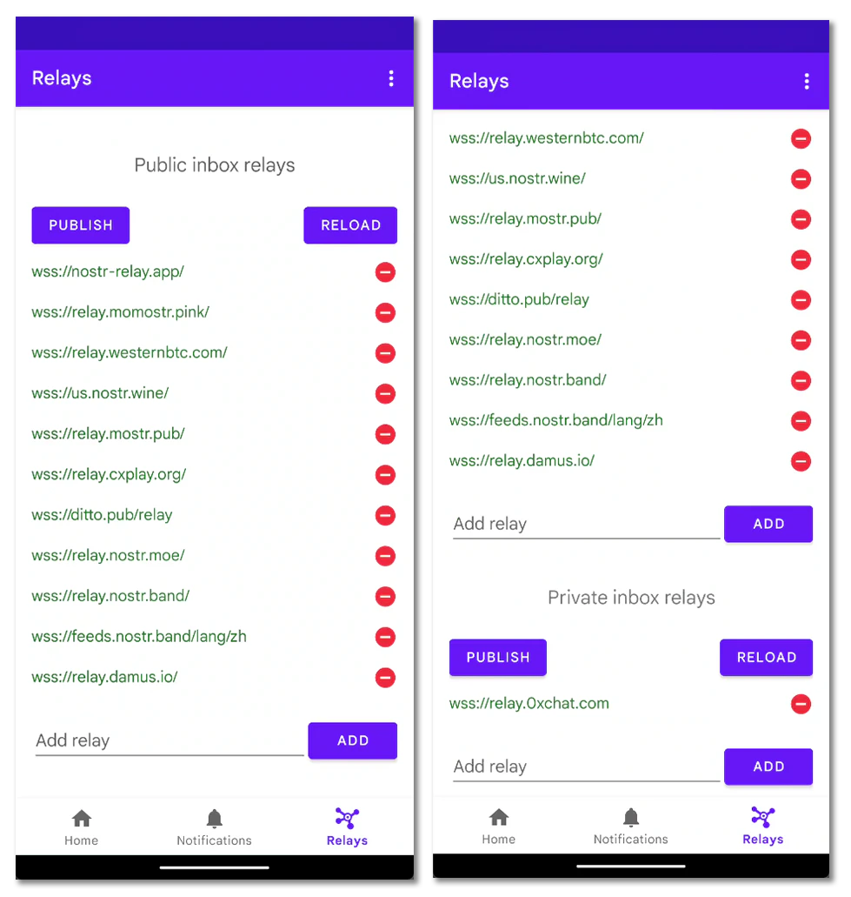

# 从 Android 设备上接收通知 {#receive-notifications-on-android-devices}

Nostr 是一个分布式的网络, 这意味着如果一个用户提及到了我们, 那么客户端也需要从各处的中继中提取出提及我们公钥的消息并解析, 然后才能实现在应用中集中展示社交媒体中已经习以为常的「通知」消息集合.

部分 Nostr 客户端除了集成通知消息获取的能力之外, 还会通过移动设备操作系统供应商的通知推送服务器向用户设备发送这些通知, 以求用户在没有打开应用的时候也能收到网络中的提及消息.

本文将介绍更加独立的解决办法, 让读者们有更多的选择.

## Pokey {#pokey}

Pokey 是开发者 *KoalaSat* 开发的一个 Android 特殊 Nostr 客户端, 它可以使用公钥或[{琥珀|Amber}](/start/become-hacker/android-key-management/)登录到应用, 然后获取用户的信箱中继列表元数据中的收件箱(只读)中继, 最后持久在后台运行保持与中继的连接, 不间断订阅提及到私钥的事件并通过 Android 通知发送出来, 这样就实现了独立地消息通知能力.

::: warning
Pokey 处于非常早期的状态, 项目仍然在开发中也还未释出稳定版本, 可能存在众多未知问题.
:::

> [KoalaSat/pokey: Nostr "Pull Notifications" on Android](https://github.com/KoalaSat/pokey)

从项目 GitHub Releases 页面获取合适的安装文件, 将其安装到设备并启动, 进入主页, 点击中间的加号按钮添加账号:

  

所有提及到公钥的事件如果没有经过加密那么都是公开的, 理所当然的能够被任何人检索. 所以只需要一个 npub 公钥就能开始获取关联的通知, 也能获取别人的公开被提及事件.

但是如果提及事件被 [NIP-04](https://github.com/nostr-protocol/nips/blob/master/04.md) 或者 [NIP-44](https://github.com/nostr-protocol/nips/blob/master/44.md) 加密之后, 那么就需要私钥解密了. 要接收这类加密消息并且还要直接在通知中查看内容就只能通过琥珀登录并授予相关权限. 此外一些中继还会要求进行客户端验证, 这也是需要私钥进行签署才能做到的, 所以最好还是使用琥珀去登录 Pokey.

登录之后, 点击 START 按钮开始监听消息, Pokey 会自动获取网络中的用户头像:

点击底栏的 Relays 栏目, 就可以看到 Pokey 获取到的收件箱中继有哪些, 其中包括了接收一般公共消息的{公开收件箱中继|Public inbox relays}和用于接收强加密消息的{私密收件箱中继|Private inbox relays}:

当然, 作为用户也可以随意添加或者移除这些中继, 以平衡设备性能与电量消耗. Pokey 应用中编辑的中继列表在未点击对应列表的 PUBLISH 按钮发布之前都是不会影响到网络中的元数据的.

::: tip
Pokey 为了保持后台进程不被意外终止, 会在通知栏产生一个持久通知. 如果已经将 Pokey 添加到了电量优化白名单中, 那么这个通知也可以直接从 Android 应用设置的通知权限里面直接关闭.
:::

## 其他 {#other-stuff}

1. Pokey 将通知消息展示在通知栏中后, 用户点击消息会打开注册了 `nostr:` URI 方法的应用. 所以为了更连贯的体验, 可以选择安装{紫水晶|Amethyst}在内的一些 Android 原生客户端来配合使用.
