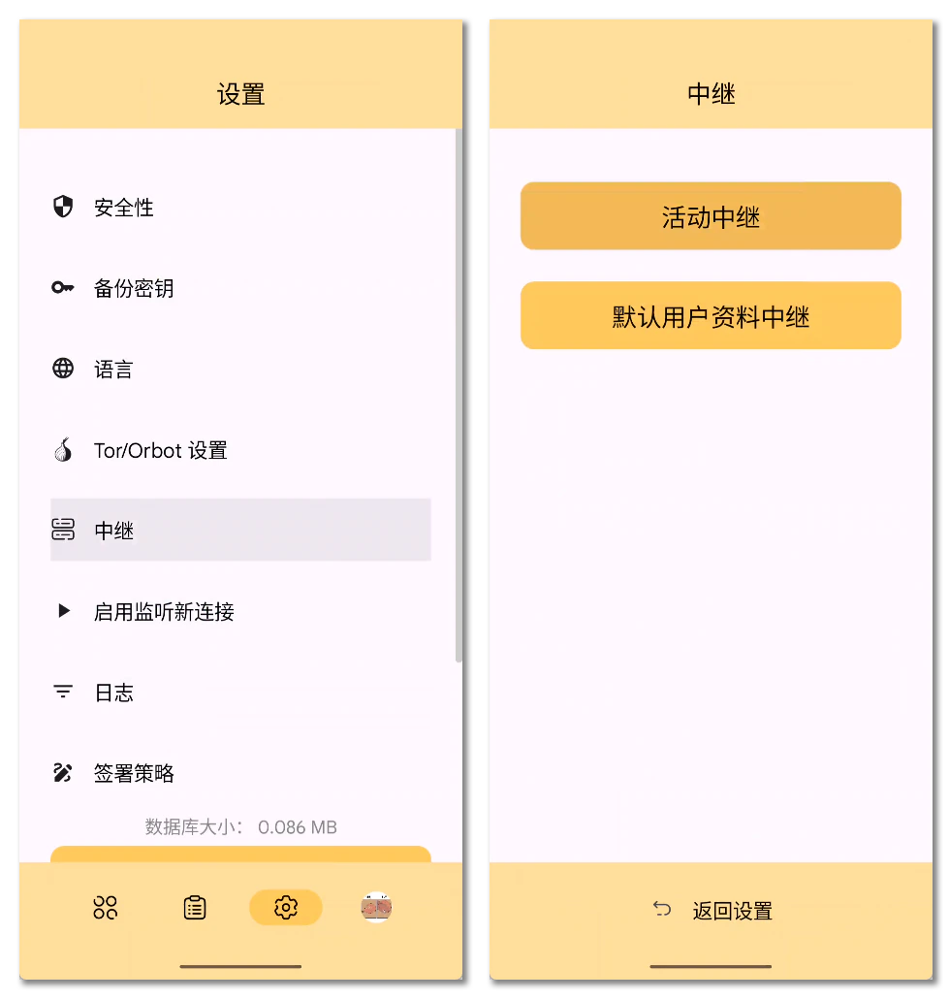

# 使用远程签名器 {#use-remote-signer}

Nostr 依赖于非对称密钥签署事件, 借助唯一的签名以达到抗审查的目的. 但是为了安全, 密钥已经从应用中剥离并被密钥管理器保护起来, 这种情况下, 只有当应用是密钥管理所处的环境下原生运行的时候才能够借助操作系统或运行环境的能力跨进程调用密钥管理器去请求事件签署, 否则密钥签署的请求将无法突破平台限制.

为了解决这个「单一平台密钥管理但需要全平台应用签署签名」的状况, Nostr 有了 "**NIP-46: 远程签署**" 议定.

> [nips/46.md at master · nostr-protocol/nips](https://github.com/nostr-protocol/nips/blob/master/46.md)

由于 Nostr 基于的 WebSocket 协议具有全双工通讯能力, 使得应用和密钥管理器之间也能通过 WebSocket 通讯, 应用借助 `kind:24133` 事件向远程的密钥管理器发起签署请求, 密钥管理器兼任的签名器角色会将签名计算后返回给应用, 以完成一次远程签名签署请求. 客户端和作为服务端的密钥管理器使用随机的 Nostr 密钥对签署通讯事件, 使用 NIP-04 或 NIP-44 加密事件内容主体, 使通讯事件不可篡改, 签署请求不被审查, 确保了远程签署的基本安全.

本文将以上一篇章介绍的 Android 密钥管理器*琥珀*为例, 将读者 Android 设备上的琥珀直接作为远程签名器运行, 并完成一次远程登录.

## 「掩体」和 Nostr Connect {#bunker-and-nostr-connect}

NIP-46 定义了两种特殊的 Nostr URI {方法|Scheme}, 也就是:

1. `bunker://`
2. `nostrconnect://`

*Bunker* 即为*掩体*含义, 是作为服务端的密钥管理器主动为客户端预先生成的连接地址. 相反的, Nostr Connect 则是指示客户端主动向服务端发起连接请求的地址.

---

掩体链接通常包含:

1. 固定方法头: `bunker://`
2. 固定用户公钥: `xxxxx`
3. 通讯用中继地址参数 `relay`: `wss://shadow.relay.stream`
4. (可选) 标记链接指定用于特定客户端的参数 `secret` : `xyzclient`

所以, 一个完整的掩体链接应该如下所示:

```text
bunker://xxxxx?relay=wss://shadow.relay.stream&secret=xyzclient
```

---

Nostr Connect 链接通常包含:

1. 固定方法头: `nostrconnect://`
2. 固定用户公钥: `xxxxx`
3. 通讯用中继地址参数 `relay`: `wss://shadow.relay.stream`
4. 标记链接属于特定客户端的参数 `secret`: `xyzclient`
5. (可选) 向远程签名器声明需要的权限列表参数 `perms`: `nip44_encrypt,nip44_decrypt`
6. (可选) 客户端自己的名称 `name`: `Nostr.moe`
7. (可选) 客户端自己的网站地址 `url`: `https://nostr.moe`
8. (可选) 客户端自己的图标 `image`: `https://nostr.moe/favicon.ico`

所以, 一个完整的 Nostr Connect 链接应该如下所示:

```text
nostrconnect://xxxxx?relay=wss://shadow.relay.stream&secret=xyzclient&perms=nip44_encrypt,nip44_decrypt&name=Nostr.moe
```

## 琥珀作为远程签名器 {#setup-amber-as-remote-signer}

> 琥珀的配置方法可参考上一篇章[《Android 密钥管理》](/start/become-hacker/android-key-management/).

打开琥珀, 进入设置,「中继」,「活动中继」设置:



点击右下角的齿轮图标也就是活动中继设置, 将 Nostr!moe 社区的掩体中继 `wss://shadow.relay.stream` 添加到中继列表, 返回中继.


::: tip
由于掩体中继可能需要承载客户端和服务端之间非常高频的 `kind:24133` 事件交换, 所以普通的保存用户内容的中继的速率限制有时会无法满足这一用途, 并且 `kind:24133` 事件需要被即时删除不能被超时保存.
:::

当中继测试通过后, 琥珀就已经准备好作为远程签名器而待命了, 接下来我们开始正式创建掩体链接.

## 创建和使用掩体链接 {#create-and-usage}

回到琥珀的主界面, 也就是底栏第一个图标. 点击右下角的加号按钮, 选择「添加 nsecBunker」:


随意输入这个掩体要使用的地方, 比如登录 Nostr!moe 的社区应用填写为 "nostr.moe", 下方会自动添加琥珀内预设的掩体中继, 当然你也能添加你想要的其他掩体中继. 点击创建, 然后就能获得琥珀生成的掩体链接:


复制这个掩体链接, 前往 Nostr!moe 社区, 使用它进行登录. 这里使用常规版客户端演示:

<video src=".assets/index/2025-05-01_221608.mp4" controls="controls" title="使用掩体链接登录 Nostr!moe">使用掩体链接登录 Nostr!moe</video>

在与中继连接无碍的情况下, 客户端授权请求将会在数秒钟之内到达琥珀中被要求处理. 到此已经完成了一次通过掩体链接登录 Nostr 应用的操作了, 如果还需要登录更多的 Nostr 应用, 只要它支持使用掩体登录, 那么就能通过琥珀创建掩体链接进行授权登录.

## 影子中继 {#shadow-relay}

「{影子中继|Shadow Relay}」是本站对负责协调 Nostr 客户端和掩体服务端(签名器)之间通讯的那个 Nostr 中继的特殊别称, 这层含义取自现实中掩体存在后必然会出现阴影区域的现象, 暗示影子中继和掩体之间的关系: 有掩体就有影子中继, 没有影子中继掩体也无法成立.

影子中继本应该只是一些普通的 Nostr 中继就能承担的角色, 但由于其实践中的特殊性, 本站认为有必要将其单独约束为一类中继. 因为影子中继相比普通中继:

1. 完全不能保留过时的 `kind:24133` 事件, 因此需要比临时事件更加强调即时删除.
2. 更高的速率限制和并发限制, 以满足签名器长时间打开 WebSocket 连接并保持事件订阅.
3. 延迟敏感, 需要确保 `kind:24133` 事件在中继中判断过期之前就将消息传递到服务端或者客户端.

NIP-46 描述了客户端和服务端的要求, 但是没有对协调通讯的影子中继做出规范, 使得现在 Nostr 常用很多中继软件都没有对这种用途做专门的适配. 某些没有适配的中继软件不会即时删除临时事件, 这对于高即时性要求的掩体连接是极其影响连接效果的. 如果 `kind:24133` 事件已经过时却没有被及时删除, 让客户端收到了过时的通讯消息, 那么会直接被客户端认为是掩体连接出现了故障. 这部分问题在早期的社区影子中继被观察到, 管理员最终只能切换中继软件到 strfry 才得以解决.

> [hoytech/strfry: a nostr relay](https://github.com/hoytech/strfry)

在这里将提供社区影子中继使用的 strfry 配置和插件, 以便于社区成员托管自己的影子中继:

:::tip
配置可能会发生变动, 请以实际情况为准.
:::

strfry 配置:

```conf
##
## Default strfry config
##

# Directory that contains the strfry LMDB database (restart required)
db = "./strfry-db/"

dbParams {
    # Maximum number of threads/processes that can simultaneously have LMDB transactions open (restart required)
    maxreaders = 256

    # Size of mmap() to use when loading LMDB (default is 10TB, does *not* correspond to disk-space used) (restart required)
    mapsize = 10995116277760

    # Disables read-ahead when accessing the LMDB mapping. Reduces IO activity when DB size is larger than RAM. (restart required)
    noReadAhead = false
}

events {
    # Maximum size of normalised JSON, in bytes
    maxEventSize = 65536

    # Events newer than this will be rejected
    rejectEventsNewerThanSeconds = 900

    # Events older than this will be rejected
    rejectEventsOlderThanSeconds = 60

    # Ephemeral events older than this will be rejected
    rejectEphemeralEventsOlderThanSeconds = 3

    # Ephemeral events will be deleted from the DB when older than this
    ephemeralEventsLifetimeSeconds = 5

    # Maximum number of tags allowed
    maxNumTags = 2000

    # Maximum size for tag values, in bytes
    maxTagValSize = 1024
}

relay {
    # Interface to listen on. Use 0.0.0.0 to listen on all interfaces (restart required)
    bind = "0.0.0.0"

    # Port to open for the nostr websocket protocol (restart required)
    port = 8080

    # Set OS-limit on maximum number of open files/sockets (if 0, don't attempt to set) (restart required)
    nofiles = 1000000

    # HTTP header that contains the client's real IP, before reverse proxying (ie x-real-ip) (MUST be all lower-case)
    realIpHeader = "x-forwarded-for"

    info {
        # NIP-11: Name of this server. Short/descriptive (< 30 characters)
        name = "Nostr!moe Shadow Relay"

        # NIP-11: Detailed information about relay, free-form
        description = "The age of the bunker is upon us, and we will all be in the shadows."

        # NIP-11: Administrative nostr pubkey, for contact purposes
        pubkey = "97eafcb1b8438d56d2a3309c6faf08ae61be618a65c87b6a295549ea773ac29d"

        # NIP-11: Alternative administrative contact (email, website, etc)
        contact = "https://www.cxplay.org/"

        # NIP-11: URL pointing to an image to be used as an icon for the relay
        icon = "https://nostr.moe/favicon.ico"

        # List of supported lists as JSON array, or empty string to use default. Example: "[1,2]"
        nips = "[46]"
    }

    # Maximum accepted incoming websocket frame size (should be larger than max event) (restart required)
    maxWebsocketPayloadSize = 131072

    # Maximum number of filters allowed in a REQ
    maxReqFilterSize = 200

    # Websocket-level PING message frequency (should be less than any reverse proxy idle timeouts) (restart required)
    autoPingSeconds = 55

    # If TCP keep-alive should be enabled (detect dropped connections to upstream reverse proxy)
    enableTcpKeepalive = false

    # How much uninterrupted CPU time a REQ query should get during its DB scan
    queryTimesliceBudgetMicroseconds = 10000

    # Maximum records that can be returned per filter
    maxFilterLimit = 500

    # Maximum number of subscriptions (concurrent REQs) a connection can have open at any time
    maxSubsPerConnection = 20

    writePolicy {
        # If non-empty, path to an executable script that implements the writePolicy plugin logic
        plugin = "./validateKind.js"
    }

    compression {
        # Use permessage-deflate compression if supported by client. Reduces bandwidth, but slight increase in CPU (restart required)
        enabled = true

        # Maintain a sliding window buffer for each connection. Improves compression, but uses more memory (restart required)
        slidingWindow = true
    }

    logging {
        # Dump all incoming messages
        dumpInAll = true

        # Dump all incoming EVENT messages
        dumpInEvents = false

        # Dump all incoming REQ/CLOSE messages
        dumpInReqs = false

        # Log performance metrics for initial REQ database scans
        dbScanPerf = false

        # Log reason for invalid event rejection? Can be disabled to silence excessive logging
        invalidEvents = true
    }

    numThreads {
        # Ingester threads: route incoming requests, validate events/sigs (restart required)
        ingester = 3

        # reqWorker threads: Handle initial DB scan for events (restart required)
        reqWorker = 3

        # reqMonitor threads: Handle filtering of new events (restart required)
        reqMonitor = 3

        # negentropy threads: Handle negentropy protocol messages (restart required)
        negentropy = 2
    }

    negentropy {
        # Support negentropy protocol messages
        enabled = true

        # Maximum records that sync will process before returning an error
        maxSyncEvents = 1000000
    }
}
```

写入策略插件 `validateKind.js`:

```JavaScript
#!/usr/bin/env node

const readline = require('readline');

// 创建标准输入流接口
const rl = readline.createInterface({
  input: process.stdin,
  output: process.stdout,
  terminal: false
});

// 监听每一行输入
rl.on('line', (line) => {
    let req;
    try {
        req = JSON.parse(line); // 解析输入的 JSON 行
    } catch (err) {
        console.error("Invalid JSON input:", err); // 若 JSON 无效, 输出错误日志
        return;
    }

    if (req.type !== 'new') {
        console.error("Unexpected request type"); // 非 `new` 类型请求, 记录日志
        return;
    }

    // 初始化响应对象, 包含事件 ID
    let res = { id: req.event.id };

    // 检查事件的 `kind` 是否为 24133
    if (req.event.kind === 24133) {
        res.action = 'accept'; // 接受事件
    } else {
        res.action = 'reject'; // 拒绝事件
        res.msg = `blocked: kind ${req.event.kind} is not allowed`; // 返回错误信息
    }

    // 输出响应 JSON, 确保每行输出一个 JSON 对象
    console.log(JSON.stringify(res));
});
```

## 服务端托管掩体 {#server-hosting-bunker}

直接在用户设备上运行远程签名器并不是适合大规模密钥托管的方案, 于是诞生了一些运行在服务端的掩体服务器, 以早期的 nsecBunker 为代表:

> [kind-0/nsecbunkerd: nsecbunker daemon](https://github.com/kind-0/nsecbunkerd)

然后就是 nostr.band 开发提供的 Nsec.app:

> [Nsec.app - Nostr Key Storage and Remote Signer](https://nsec.app/)

以上的软件都是开源的, 社区成员 xtao 也提供了运行在本社区子域名上的自托管版本 Nsec.app:

> <https://noauth.nostr.moe>

掩体服务端需要用户直接提供私钥以供后端签名器计算, 对于不想在 Android 设备上将琥珀作为掩体服务器使用的社区成员来说, 可以酌情选择更加便利的托管版本掩体服务器.
