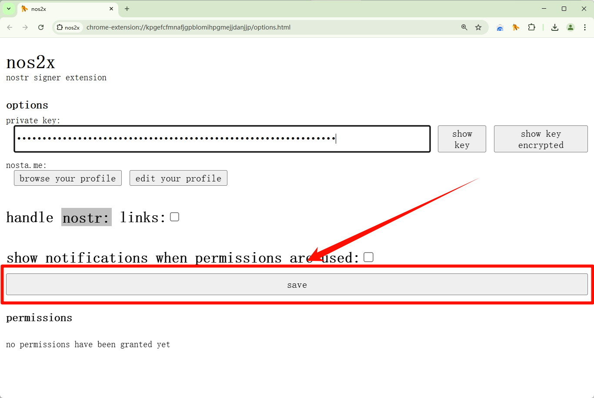

# 快速加入 Nostr {#quick-join-nostr}

## 前言

如果你还不知道什么是 Nostr, 或者你已经使用过了 Fediverse 相关应用, 那么可以尝试阅读以下文章深入了解这两者的区别和优缺点:

> [为什么我不推荐 Nostr 和 Fediverse? | CXPLAY World](https://blog.cxplay.org/works/why-dont-i-recommend-use-nostr-and-fediverse/)

简而言之, Nostr 是相比联邦制为基础的 Fediverse 而言去中心化更加彻底的协议, 联邦制的社交网络也包括了后来新秀 Bluesky.

但是, 虽然两年过去了, 协议的社交生态已经接近完善, 这里还是有不得不对想要尝试的读者说的一些「丑话」, 好节约部分读者的时间:

1. Nostr 协议和协议生态受到比特币资金的直接资助, 内循环经济和总体共识也是比特币为首.
2. Nostr 是个真正的分布式去中心化社交网络, 相比中心化和联邦式社交网络, 你已经发布的内容的传播方式并不完全受你控制, 包括删除操作.
3. 密钥对的使用难度仅仅比 GPG 稍低一些, 并且 Nostr 不存在现行广泛应用的密钥吊销和子密钥协定, 需要你有良好的密钥管理和安全习惯.
4. Nostr 协议的各个实现议定(NIP)不使用开源协议, 而是默认直接置于公有领域.

本指南均在桌面环境下进行指导.

## 创建密钥对 (账户)

在 Nostr 中, "账户" 的概念已经被为公钥和私钥取代, 如果你使用过 GPG, 那么就不难理解其背后的用意, Nostr 就是使用密钥对进行签署和加密的通讯协议, 不过 Nostr 使用的算法是比特币在内的加密货币使用的算法 secp256k1. 如果你没有接触过非对称加密, 类比一下既是: 公钥等于唯一账户名, 私钥等于账户密码, 而这里的账户名和密码永远唯一且无法被修改.

确保你使用的设备是安全的. 使用浏览器隐私模式打开网页工具: <https://nak.nostr.com/>

> 如果有更高的安全要求, 建议使用一次性的离线虚拟机将工具链导入后离线操作, 直到操作到加密私钥导出.

点击 "generate keypair" 生成一对密钥:

在 (2) 标记框中所显示的内容为:

1. **private key (hex)**: 十六进制的私钥, 通常用于机器内运算使用.
2. **nsec**: 编码后的私钥, 具有明显的 `nsec` 头部便于人类识别.
3. **public key (hex)**: 十六进制的公钥, 通常用于机器内运算使用.
4. **npub**: 编码后公钥, 具有明显的 `npub` 头部便于人类识别.
5. **nprofile**: 另一种编码后的公钥, 主要用于指向用户的资料, 所以使用了 `nprofile` 为头部.

这五部分中, 只需要将 **nsec** 作为密码, **npub** 作为账户名保存在密码管理器中即可. 但要注意, nsec 永远无法被修改, 一旦泄露将永远丢失账户的掌控权, 请将其作为比密码还要重要的信息保存起来.

保存完毕后关闭隐私标签页, 用剪贴板传递 nsec 之后注意清空剪贴板记录.

## 安装密钥管理器

1. **Chrome 或类 Chromium:** [nos2x - Chrome 应用商店](https://chromewebstore.google.com/detail/nos2x/kpgefcfmnafjgpblomihpgmejjdanjjp)
2. **Firefox**: [nos2x-fox – Get this Extension for 🦊 Firefox \(en-US\)](https://addons.mozilla.org/en-US/firefox/addon/nos2x-fox/)

> 本文使用类 Chromium 浏览器的 nos2x 作为演示.

右键 nos2x 的图标打开扩展选项:

在 private key 下的输入框输入你刚刚生成的 nsec 然后保存

点击 show key encrypted 按钮:

在出现的 password 输入框输入一个**只有你脑子里记住且永远不会记在其他地方包括密码管理器的密码作为 PIN**, 支持数字字母, 建议至少四位及以上.

输入完成后点击 encrypt and show key, 显示被对称加密后的私钥:

此时被显示出来的以 **ncryptsec** 开头出现在 private key 输入框中和下方二维码中的私钥既是使用你输入的密码加密后的私钥, 将这个 ncryptsec 作为一个新的密码保存在密码管理器中即可. 此时建议将 nsec 单独保存在一个独立的密码库中, 之后如果要传递私钥, 尽量让这个 ncryptsec 作为包装后的私钥进行传递.

此后需要记住, 永远不要将私钥包括包装后的私钥交给你无法完全确认风险的地方, 永远优先使用可信的密钥管理器来管理密钥.

## 创建用户资料

密钥对如果没有任何事件与之关联则没有任何价值, 所以现在需要为这对密钥创建一个 Nostr 网络中的用户资料.

> 不建议使用 nos2x 中提示的那个外部资料编辑器.

打开独立的用户资料管理器: <https://metadata.nostr.com/>

点击 Load My Profile 弹出密钥管理器授权请求:

这个网站会请求 **read your public key** 权限, 也就是 "读取你的公钥" 权限, 用于查找你的用户资料, 点击 authorize just this 授权这次读取.

此时网站会进行查找, 会提示 **No Profile Events Found**, 这是意料之中的, 因为我们刚刚创建了一个全新的密钥对.

点击上方导航栏的 **Metadata** 进入用户资料编辑器:

填写用户资料表单:

1. **name**: 你想要的任何名字, 这会显示在你今后的用户资料上, 建议填写.
2. **nip05**: 域名身份标签, 这里暂时不填写.
3. **about**: 关于你的描述, 建议填写.
4. **picture**: 你的头像, 需要输入一张图片的外链, 建议填写. (实在找不到, 可以先去 [nostr.build](https://nostr.build/freeview/?k=img) 随便右键复制一张图片的链接过来先用着)
5. **banner**: 资料页中显示的横幅背景, 暂时先不填写.
6. **lud06 (LNURL)**: 闪电网络的收款 URL, 已经是过时的字段了, 不填写.
7. **lud16**: 闪电网络的收款地址, 暂时先不填写.

> 所有的字段都是可选的, 也可以随时修改.

填写完成后点击 Save 保存你的用户资料.

此时密钥 nos2x 会弹出授权提示签署你的第一个事件:

点击 authorize just this 允许本次签署.

注意, 此时这份用户资料仅仅只是签署了之后保存在了网站缓存里面, 还没有真正传递到 Nostr 网络上, 请继续完成下面的中继配置设置.

## 配置中继

同样是 metadata.nostr.com, 签署你的用户资料后能够预览到一部分资料.

此时点击导航栏的 Relays 进入中继配置:

不用管 read 和 write 选项, 直接在输入框中输入以下几个推荐中继, 一个中继输入后点击 Add 再添加一行:

1. `wss://relay.damus.io/`
2. `wss://relay.nostr.band/`
3. `wss://nostr-relay.app/`
4. `wss://nos.lol/`
5. `wss://purplerelay.com/`

然后点击 Save, 保存配置, 网站会请求密钥管理器 nos2x 签署事件

点击 authorize just this 允许本次签署, 向这些中继发布中继配置元数据.

此时建议重复上一节的用户资料操作, 再一次完善你的用户资料后发布到这些你设置的中继中, 接下来开始正式进入 Nostr 网络了.

## 使用客户端

Nostr 有非常非常多的客户端, 这里将从最基础的社交媒体客户端开始.

打开 Nostr.moe 社区客户端: <https://nostr.moe/>

点击左下角的 "登录" 按钮, 弹出登录弹窗, 选择 "浏览器插件登录":

此时会 nos2x 弹出 **read your public key** 授权请求弹窗, 点击 authorize just this 允许本次授权, 如果你以后想要自动授权使用公钥登录, 那么就点击 authorize forever.

> 任何人都可以读取你的公钥, 读取公钥也不会损害账户.

授权完成后你就成功登录到 Nostr.moe 社区了, 左下角不出意外会显示出你的头像和用户名:

点击一下就可以弹出二级窗口, 选择 "个人资料" 就可以看到你设置的所有资料了:

## 发布帖子

还是在 Nostr.moe 社区, 点击左侧边栏的 "发布笔记" 开始编辑你的第一条正式帖子:

随便写点什么, 可以传图片上去:

> Nostr 发图片的方式就是插入图片链接.

点击 "发布笔记" 请求 nos2x 授权签署:

点击 authorize just this 允许本次授权, 如果你以后想要在 Nostr.moe 自动授权签署这类笔记的发布, 那么就点击 authorize forever.

> 如果你收到了神秘事件(你还不知道的授权类型)的授权请求, 请首选考虑拒绝(reject), 如果多次来骚扰你, 直接点击 reject \*\** forever 即可.

发布之后, 右下角会提示你已经成功发布, 但你会发现, 笔记还是没有出现在你的视野中:

不要惊恐不要失望, 点击你显示资料页栏目中的 "重新加载笔记" 看看:

笔记出现在了你的资料中, 说明笔记成功发布出去了, 笔记右下角的计数器就表示在哪些中继(服务器)中找到了你的笔记.

## 尽情探索

欢迎加入 Nostr! 不管你是否打算在此停留多久.

探索原则:

1. 永远不要授权你不知道实际用途的事件的签署请求, 也不要允许客户端签署你不想要的任何事件, 比如突然请求更新你的用户资料等.
2. 永远不要将你的任何形式的私钥暴露给其他任何人.
3. 永远不要在任何客户端中直接使用私钥, 如果它要求你只能输入私钥使用, 请放弃这个客户端.

你可能需要像二次确认用户资料一样, 你还需要确认一遍你的中继配置是否完整:

不出意料的话, 这里很可能是空的:

所以你需要将[配置中继](#配置中继)小节的那些中继再次输入到客户端进行 "添加".

这样才能确保你的基础连接是没有问题的, 除了 "探索原则", 这里还有几条重要提示, 是由于分布式网络带来的额外特性:

1. 你的用户资料(kind:0)和中继配置(kind:10002)是最重要的账户元数据, 需要看好它们, 并让它们尽可能地传播地越广越好.
2. Nostr 作为社交网络运行时, 无法做到 "私密账户" 或 "带锁账户" 这种东西, 你的消息内容没有准备好为每个已知的受众进行不对称加密, 公共消息永远无法做到权限控制.
3. Nostr 被签署并广播的消息不存在 "永远删除", 一旦被签署并广播, 消息就无法被完全撤回. Nostr 的删除更像是声明为 "无效", 当然也只有消息公钥对应的私钥才能签署声明这种 "无效" 状态.
4. Nostr 的关注始终是单向同意的, 所以被关注者永远无法获知自己确切的粉丝数量.
5. Nostr 帖子的发布者无法主动审查帖子关联线程中的消息, 包括作者在内的所有人都只能选择隐藏.
